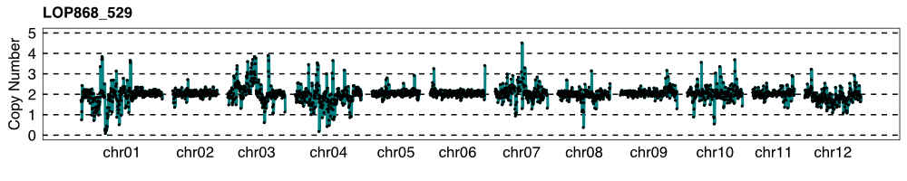

snakemake_chrom_dosage, a karyotyping tool

## Summary

This Snakemake workflow outputs read coverage by bin across a reference sequence, using
raw fastq reads in the subdirectory ```data/reads``` and a table of sample information,
```units.tsv``` as input. The bam file corresponding to control sample (including path)
is specified in ```config.yaml```.

For a sample at hand, the value for relative coverage of a bin are obtained by dividing
the fraction of all mapped reads that map to that bin by the corresponding fraction in the
control sample. Finally, all values are multiplied by 2 such that values for bins present
in 2 copies would oscillate around 2.

For each sample, this workflow outputs a table containing the number of reads processed 
and the relative coverage values for each bin, as well as a plot of the relative coverage
values.

I wrote this as an alternative, not a replacement, to the standard Comai lab pipeline of
bwa-doall + bin-by-sam. Reasons being:

1. bwa-doall is optimized for a single-node server with a lot of available CPU. It was not
developed for use on a standard cluster, running, e.g., SLURM. This workflow runs on the
cluster, which spreads independent tasks both across CPUs within a node and across nodes.

2. The last step in the workflow, plot generation, was previously done manually in JMP.
This pipeline automates that step.

## Steps

1. Build DM1-3 v4.04 reference genome, including DM chloroplast and mitochondrion sequence
2. Download reads from NCBI SRA
3. Read QC (cutadapt)
4. BWA mem alignment
5. Remove PCR duplicates (Picard MarkDuplicates)
6. Filter out low-quality alignments (samtools view -q <quality>)
7. Count reads in non-overlapping bins (bedtools coverage)
8. Normalization to a user-specified control sample and dosage plot generation (custom R script)

For each sample, one plot showing relative coverage values per bin and one table with the
raw read counts and relative coverage values for each bin will be put in ```data/plots```

## Test case

As a test case, this pipeline will download reads for 3 low-pass samples from NCBI SRA
and the DM v4.04 reference assembly, then make dosage plots using one of the samples
as a control for the other two. Here's an example plot generated from the test case:



1. Clone this repo:

```
git clone https://github.com/kramundson/snakemake_chrom_dosage
cd snakemake_chrom_dosage
```

2. Install miniconda3:

```
wget https://repo.continuum.io/miniconda/Miniconda3-latest-Linux-x86_64.sh
bash Miniconda3-latest-Linux-x86_64.sh

# review license
# accept license
# accept or change home location
# yes to placing it in your path

source $HOME/.bashrc
```

3. Build environment using included file ```environment.yaml```:

```
conda env create --name dosage -f environment.yaml
# follow prompts to finish environment build

# activate environment
source activate dosage
```

4. Run workflow:

```
# build reference genome, download reads, data processing, make dosage plots using 8 cores
snakemake -s fastq_to_dosage_plot.snakes --cores 8 > fastq_to_dosage_run1.out 2> fastq_to_dosage_run1.err
```

## How to run with your own datasets

Here, we'll go though an example of how to add new samples to the analysis using publicly
available reads from NCBI SRA. We're going to analyze one more sample, called LOP868_005.
The NCBI SRA ID for this library is SRR6123029. It consists of ~4.5 million 50bp single-end
Illumina reads.

1. Put new reads to be analyzed in the folder ```./data/reads``` that was created during
the test case. Here, we download the reads directly from SRA using fastq-dump, which is
included with ```sra-tools=2.8.2``` that was installed using conda.

```
fastq-dump --gzip -B --split-3 -O data/reads SRR6123029
```

If you have your own reads to add, this step is even easier. All you need to do is put
them in the ```data/reads``` folder.

2. Add sample and unit information for new reads to ```units.tsv```.

To add information to LOP868_005, I'm going to parse information available from NCBI SRA.
The necessary info can be found at NCBI [here](https://www.ncbi.nlm.nih.gov/Traces/study/?acc=SRP119212)

Then, download the SRA RunInfo table. I've downloaded the table and saved it in this repo
as ```LOP_SraRunTable.txt```.

To add the necessary info from sample LOP868_005, we'll extract only the rows and columns
we need, do a little column rearranging, and add the rearranged row to the end of the
existing units.tsv column. Note, only do this step once! If you repeat this step, it will
keep adding lines to ```units.tsv```. We'll make a backup copy of units.tsv just in case.

```
# copy original units.tsv just in case
cp units.tsv units.tsv.bak

# extract rows/cols from LOP_SraRunTable.txt and add to units.tsv
grep "SRR6123029" LOP_SraRunTable.txt | awk -v OFS='\t' '{print $19,$17,$17".fastq.gz","NaN","haploid"}' >> units.tsv
```

If you're adding your own reads, the fq1 column should be the name of the file you put
in ```data/reads```. The fq2 column should be "NaN", and the parhap column "haploid".
For the sample column, use alphanumeric characters and underscores to assign biological
sample names. Rows in ```units.tsv``` corresponding to the same biological sample can have
the same name, if desired. For the unit column, use alphanumeric characters and
underscores. Each row in ```units.tsv``` should be a unique name, i.e., do not duplicate
unit names.

Notes on the logic of ```units.tsv```:

units.tsv is a 5-column tab delimited text file. The columns specify the following:

sample: unique biological sample
units: unique combination of biolgical sample, library and sequencing run
fq1: name of file corresponding to the sample-unit combination located in ```data/reads```
fq2: always NaN for this analysis (left in for paired-end data analyses that takes the same type of table)
parhap: left in from legacy version, just put "haploid" here and it will run fine.

3. Run the workflow again. Snakemake should start processing the new sample.

```
snakemake -s fastq_to_dosage_plot.snakes --cores 8 > fastq_to_dosage_run2.out 2> fastq_to_dosage_run2.err
```

Other notes:

To change which sample is used as the control, you will need to edit ```config.yaml```.
Currently, sample LOP868_538 is used as the control. You can change this to be any sample
in your ```units.tsv``` file, but be sure to keep the preceding path
```data/bedtools_coverage``` and give the sample name a .bed extension.
Other command line parameters can also be changed here, if desired.

Option for UCD users: Cluster-friendly workflow. Snakemake will spawn individual jobs with
job-specific compute allocation specified in ```cluster.yaml```.

```
# to run cluster implementation
# test case was successful on UCD cluster
# will crash with very large files at MarkDuplicates due to insufficient JVM memory allocation
sbatch runSnakes.slurm
```

To run this on a different cluster, ```cluster.yaml```, ```config.yaml```, and
```runSnakes.slurm``` will  need to be modified to suit your needs.
